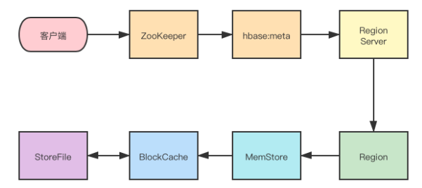
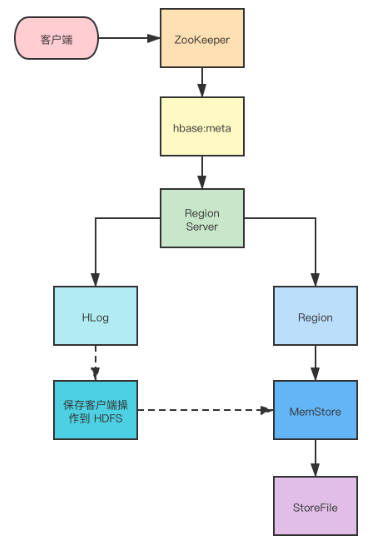

# 三、HBase读写流程

**声明：本文根据网上资料整理的学习笔记，严禁商用**。

**读操作**

首先从 ZooKeeper 找到 meta 表的 region 位置，然后读取 hbase:meta 表中的数据， hbase:meta 表中存储了用户表的 region 信息
根据要查询的 namespace 、表名和 rowkey 信息，找到写入数据对应的 Region 信息
找到这个 Region 对应的 RegionServer ，然后发送请求
查找对应的 Region
先从 MemStore 查找数据，如果没有，再从 BlockCache 上读取
HBase 上 RegionServer 的内存分为两个部分一部分作为 MemStore ，主要用来写;。
另外一部分作为 BlockCache ，主要用于读数据;

如果 BlockCache 中也没有找到，再到 StoreFile(HFile) 上进行读取
从 StoreFile 中读取到数据之后，不是直接把结果数据返回给客户端，而是把数据先写入到 BlockCache 中，目的是为了加快后续的查询;然后在返回结果给客户端。

**写操作**

首先从 ZooKeeper 找到 hbase:meta 表的 Region 位置，然后读取 hbase:meta 表中的数据， hbase:meta 表中存储了用户表的 Region 信息
根据 namespace 、表名和 rowkey 信息找到写入数据对应的 Region 信息
找到这个 Region 对应的 RegionServer ，然后发送请求
把数据分别写到 HLog ( WriteAheadLog )和 MemStore 各一份
MemStore 达到阈值后把数据刷到磁盘，生成 StoreFile 文件
删除 HLog 中的历史数据。
