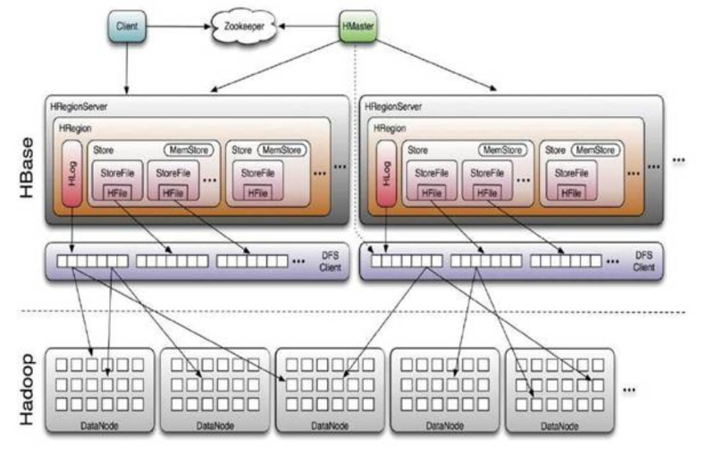
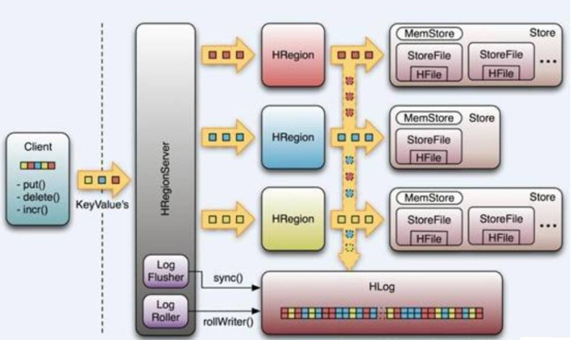

- # 二、HBase体系结构

- **声明：本文根据网上资料整理的学习笔记，严禁商用**。

     ​      

- 在HBase中，表被分成区域，并由区域服务器提供服务。区域按列族垂直划分为“Stores”。Stores以文件形式保存在HDFS中。下面显示的是HBase的体系结构。

     

HBase具有三个主要组件：客户端库，主服务器和区域服务器。可以根据需要添加或删除区域服务器。

- 
         ​    主服务器(master)
             主服务器-

- 将区域分配给区域服务器，并利用Apache ZooKeeper的帮助完成此任务。
- 处理跨区域服务器的区域负载平衡。它卸载繁忙的服务器，并将区域转移到占用较少的服务器。
- 通过调度负载均衡来维护集群的状态。
- 负责架构更改和其他元数据操作，例如创建表和列系列。

- 
         ​    区域服务器(regions)
             区域不过是分散在区域服务器中并分散在各个区域服务器中的表。
             区域服务器
             区域服务器具有的区域-

- 与客户端通信并处理与数据相关的操作。
- 处理其下所有区域的读写请求。
- 通过遵循区域大小阈值来确定区域的大小。
         当我们深入研究区域服务器时，它包含区域和存储，如下所示：

Store包含Memstore和HFiles。Memstore就像一个缓存。最初输入到HBase的所有内容都存储在此处。以后，数据将作为块传输并保存在Hfiles中，并且刷新了存储器。

- 
             Zookeeper
             Zookeeper是一个开源项目，提供诸如维护配置信息，命名，提供分布式同步等服务。
             Zookeeper具有代表不同区域服务器的临时节点。主服务器使用这些节点发现可用的服务器。
             除了可用性，这些节点还用于跟踪服务器故障或网络分区。
             客户端通过zookeeper与区域服务器通信。
             在模拟和独立模式，HBase由zookeeper来管理。