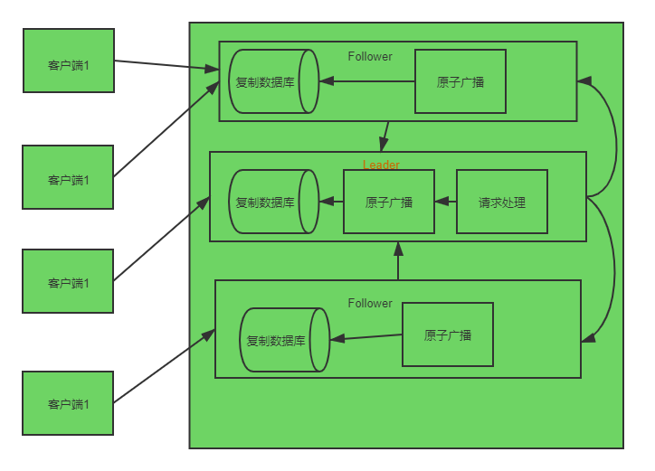

## 三、ZooKeeper 工作流程

**声明：本文根据网上资料整理的学习笔记，严禁商用**。

- #### 工作流程

  ZooKeeper集合（服务器组）启动后，它将等待客户端连接。客户端将连接到ZooKeeper集成中的节点之一。它可能是Leader节点或跟Follower节点。客户端连接后，节点将为特定客户端分配会话ID，并向该客户端发送确认。如果客户端未收到确认，则仅尝试连接ZooKeeper集合中的另一个节点。连接到节点后，客户端将定期发送心跳信号到该节点，以确保连接不会丢失。

  - 如果客户端希望读取特定的znode，则它将具有znode路径的读取请求发送到该节点，并且该节点通过从其自己的数据库获取请求的znode来返回该请求。因此，在ZooKeeper集成中读取速度很快。
  - 如果客户端希望将数据存储在ZooKeeper集合中，则它将znode路径和数据发送到服务器。连接的服务器会将请求转发给Leader服务器，然后Leader将向所有Follower重新发出写请求。如果只有大多数节点成功响应，则写请求将成功，并且成功的返回码将发送到客户端。否则，写入请求将失败。严格的大多数节点称为Quorum。

- #### ZooKeeper集合中的节点

  让我们分析一下ZooKeeper集合中具有不同数量节点的影响。

  - 如果我们只有一个节点，则当该节点发生故障时，ZooKeeper集合也会失败。它会导致“单点故障”，不建议在生产环境中使用它。
  - 如果我们有两个节点，并且一个节点发生故障，那么我们也不会拥有多数，因为两个之中的一个不是多数。
  - 如果我们有三个节点，而一个节点发生故障，则我们占多数，因此这是最低要求。ZooKeeper集成必须在实时生产环境中至少具有三个节点。
  - 如果我们有四个节点，而两个节点发生故障，那么它将再次失败，这类似于具有三个节点。多余的节点没有任何作用，因此最好以奇数（例如3、5、7）添加节点。

  我们知道，在ZooKeeper集合中，写入过程比读取过程昂贵，因为所有节点都需要在其数据库中写入相同的数据。因此，对于负载均衡的环境，拥有较少数量的节点（3、5或7）比拥有大量节点更好。

  下图描述了ZooKeeper 工作流程，随后的表格解释了其不同的组件。

  

  下表说明了ZooKeeper工作流程中的每个组件。

  | 组件               | 说明                                                         |
  | :----------------- | ------------------------------------------------------------ |
  | **写**             | 写入过程由领导者（Leader）节点处理。领导者（Leader）将写请求转发到所有znode，并等待来自znode的回复。如果一半的znodes回复，则写入过程已完成。 |
  | **读**             | 读取是由特定的已连接znode在内部执行的，因此无需与集群进行交互。 |
  | **复制数据库**     | 它用于在Zookeeper中存储数据。在一致性的帮助下，每个znode都有自己的数据库，每个znode每次都具有相同的数据。 |
  | **领导Leader**     | Leader是负责处理写请求的Znode。                              |
  | **追随者Follower** | 追随者Follower从客户端接收写请求，并将其转发给领导者（Leader）znode。 |
  | **请求处理器**     | 仅在领导节点中存在。它控制来自跟随者（Follower）节点的写请求。 |
  | **原子广播**       | 负责将更改从领导者（Leader）节点传播到跟随者（Follower）节点。 |