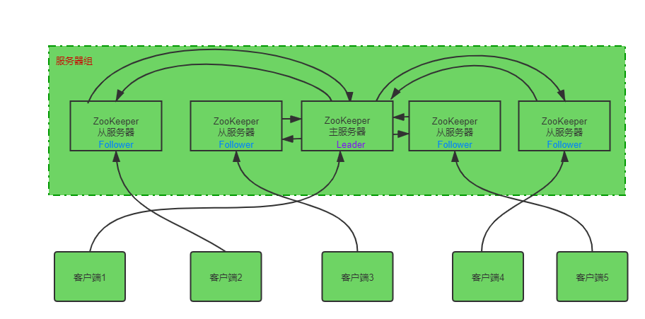
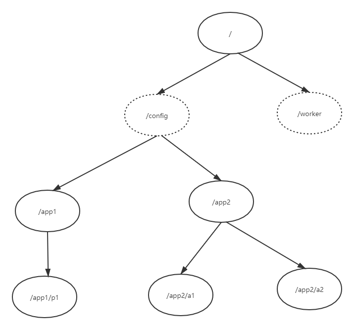

## 二、ZooKeeper 基础知识

- #### 基础知识

  

  在深入探讨ZooKeeper的工作之前，让我们看一下ZooKeeper的基本概念。我们将在本章中讨论以下主题-

  - **结构**
  - **分层命名空间**
  - **会话**
  - **监视**

- #### ZooKeeper的体系结构

  看下图。它描述了ZooKeeper的“客户端-服务器体系结构”。

  

  下表说明了ZooKeeper体系结构中的每个组件。

  | 组件                 | 说明                                                         |
  | -------------------- | ------------------------------------------------------------ |
  | **客户端（client）** | 客户端是我们分布式应用程序集群中的节点之一，可从服务器访问信息。在特定的时间间隔内，每个客户端都会向服务器发送一条消息，以使服务器知道该客户端还活着。同样，当客户端连接时，服务器会发送确认。如果连接的服务器没有响应，则客户端会自动将消息重定向到另一台服务器。 |
  | **服务器（Server）** | 服务器是ZooKeeper服务器组中的节点之一，可为客户端提供所有服务。向客户端发出确认以通知服务器处于活动状态。 |
  | **服务器组**         | ZooKeeper服务器组。形成集合所需的最小节点数为3（至少需要三台服务器）。 |
  | **Leader主服务器**   | 如果任何连接的节点发生故障，则执行自动恢复的服务器节点。在服务启动时选出Leader。 |
  | **Follower从服务器** | 遵循Leader指令的服务器节点。                                 |

- #### 分层命名空间

  下图描述了用于内存表示的ZooKeeper文件系统的树结构。ZooKeeper节点称为znode。每个znode由一个名称标识，并由一系列路径（/）分隔。

  - 在图中，首先您有一个以“/”分隔的根znode。在root下，您有两个逻辑名称空间config和worker。
  - config命名空间用于集中配置管理和worker命名空间用于命名。
  - 在config命名空间下，每个znode最多可以存储1MB数据。这类似于UNIX文件系统，除了父znode也可以存储数据。该结构的主要目的是存储同步数据并描述znode的元数据。该结构称为**ZooKeeper数据模型**。

  

  ZooKeeper数据模型中的每个znode都维护一个统计结构。统计信息仅提供znode 的元数据。它由版本号，操作控制列表（ACL），时间戳和数据长度组成。

  - **版本号** - 每个znode都有一个版本号，这意味着与znode关联的数据每次更改时，其相应的版本号也会增加。当多个Zookeeper客户端试图在同一znode上执行操作时，使用版本号很重要。
  - **动作控制列表（ACL）** - ACL基本上是用于访问znode的身份验证机制。它控制着所有znode的读写操作。
  - **时间戳** - 时间戳表示从znode创建和修改起经过的时间。通常用毫秒表示。ZooKeeper通过“交易ID”（zxid）识别对znode的所有更改。Zxid是唯一的，并且为每个事务维护时间，因此您可以轻松确定从一个请求到另一个请求所经过的时间。
  - **数据长度** - 存储在znode中的数据总量就是数据长度。您最多可以存储1MB的数据。

  **Znodes的类型**

  Znodes分为持久性，顺序性和短暂性。

  - **持久性znode** - 即使在断开了创建该特定znode的客户端的连接之后，持久性znode仍然有效。默认情况下，除非另有指定，否则所有znode都是持久性的。
  - **临时znode** - 临时znode处于活动状态，直到客户端处于活动状态。当客户端与ZooKeeper集成断开连接时，临时znode会自动删除。因此，临时znode不允许再有子节点。如果删除了临时znode，则下一个合适的节点将填充其位置。临时znode在Leader选举中扮演重要角色。
  - **队列znode** - 队列znode可以是持久性的，也可以是短暂的。当将新的znode创建为队列的znode时，ZooKeeper会通过在原始名称上附加一个10位的序列号来设置znode的路径。例如，如果将路径为/myapp的znode创建为顺序znode，则ZooKeeper会将路径更改为/myapp0000000001并将下一个序列号设置为0000000002。如果同时创建了两个队列的znode，则ZooKeeper永远不会使用相同的数字命名每个znode。队列znode在锁定和同步中起重要作用。

- #### 会话

  会话对于ZooKeeper的操作非常重要。会话中的请求以FIFO顺序执行。客户端连接到服务器后，将建立会话并将会话ID分配给客户端。

  客户端在特定时间间隔发送心跳以保持会话有效。如果ZooKeeper集合在服务启动时指定的时间段（timeout）内没有收到来自客户端的心跳，则它确定客户端死亡。

  会话超时通常以毫秒为单位。当会话由于某种原因结束时，在该会话期间创建的临时znode也会被删除。

- #### 监视

  监视是一种简单的机制，可以使客户端获得有关ZooKeeper集成中的更改的通知。客户端可以在读取特定的znode时设置监视。监视将向znode（客户机在其上注册）的任何更改发送通知到已注册的客户机。Znode更改是与znode关联的数据的修改或znode的子级中的更改。监视仅触发一次。如果客户端再次想要通知，则必须通过另一个读取操作来完成。连接会话过期后，客户端将与服务器断开连接，并且关联的监视也将被删除。