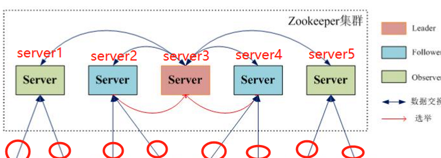

## 四、ZooKeeper Leader 节点选举

**声明：本文根据网上资料整理的学习笔记，严禁商用**。

**一、概念过程**

1 . 接收投票消息。投票消息会包括id,zxid,epoch,state，这四种信息，分别代表

​	**Id:** 唯一标识一台机器，存储在myid文件中

​	**Zxid:** 标识了本机想要选举谁为leader，是本机目前所见到的最大的id值。

​	ZooKeeper状态的每次变化都接收一个ZXID(ZooKeeper事务id)形式的标记。ZXID是一个64位的数字，由Leader统一分配，全局唯一，不断递增。ZXID展示了所有的ZooKeeper的变更顺序。每次变更会有一个唯一的zxid，如果zxid1小于zxid2说明zxid1在zxid2之前发生。

​	**Epoch:** 逻辑时钟。用于判断选举是否过期

​	**State:** 本机的状态信息(包括looking，leading，following，observing)

2 .判断PeerState状态，如果是looking状态，则继续.如果是leading,foolowing,observing则走别的流程 

3 .收到票后，会判断发送过来的逻辑时钟是否大于目前的逻辑时钟,如果是说明集群已经进入了新一轮的投票了。

4 .清空投票箱。因为这个之前的投票都是上一次投票期间维护的。

5 . 如果等于目前的逻辑时钟，说明是当前的，则更新最大的leader id和提案id

判断是否需要更新当前自己的选举情况.在这里是根据选举leader id,保存的最大数据id来进行判断的,这两种数据之间对这个选举结果的影响的权重关系是:首先看数据id,数据id大者胜出;其次再判断leader id,leader id大者胜出，

判读投票结果代码 

6 . 发送通知，通知其他的QuorumPeer更新leader信息.同时将更新后的leader信息放入投票箱，检查是否已经接收到了所有服务器的投票代码参考。如果是的，则设置自己的选择结果 

如果没有接收到所有服务器的投票，那判读这个leadId是否得到了一半以后的服务器的投票代码参考，如果是则返回 。

**二、案例：**在这四种角色中，Leader是怎么被选举出来的呢？

1、Zookeeper中的Server数目一般为奇数？

我们知道在Zookeeper中 Leader 选举算法采用了Quorom算法。该算法的核心思想是当多数Server写成功，则任务数据写成功。假设有3个Server，则最多允许一个Server挂掉；如果有4个Server，则同样最多允许一个Server挂掉。既然3个或者4个Server，同样最多允许1个Server挂掉，那么它们的可靠性是一样的，所以选择奇数个ZooKeeper Server即可，这里选择3个Server。

2、什么是Quorom算法？

在分布式系统中，冗余数据是保证可靠性的手段，因此冗余数据的一致性维护就非常重要。一般而言，一个写操作必须要对所有的冗余数据都更新完成了，才能称为成功结束。比如一份数据在5台设备上有冗余，因为不知道读数据会落在哪一台设备上，那么一次写操作，必须5台设备都更新完成，写操作才能返回。

对于写操作比较频繁的系统，这个操作的瓶颈非常大。Quorum算法可以让写操作只要写完3台就返回。剩下的由系统内部缓慢同步完成。而读操作，则需要也至少读3台，才能保证至少可以读到一个最新的数据。

3、Zookeeper节点的一些状态

（1）LEADING：说明此节点已经是leader节点，处于领导者地位的状态，差不多就是一般集群中的master。但在zookeeper中，只有leader才有写权限，其他节点（FOLLOWING）是没有写权限的，可以读。

（2）LOOKING：选举中，正在寻找leader，即将进入leader选举流程中

（3）FOLLOWING：跟随者状态，表示当前集群中的leader已经选举出来了，本台服务器处于跟随状态。

（4）OBSERVING：OBSERVING和FOLLOWING差不多，但不参加投票和选举，接受leader选举后的结果

下面来正式介绍一下选举机制（以5台服务器为例）：

 

1、每个Server都有一个唯一标识自己的myid。选举过程中每个Server都有一票（挂掉的除外）在这里我们从左到右分别将五台服务器的myid赋值为1，2，3，4，5

2、Zxid类似于RDBMS中的事务ID，用于标识一次更新操作的Proposal ID。每次请求对应一个唯一的zxid,如果zxid a < zxid b ，则可以保证a一定发生在b之前。

3、选举分为两种情况：初始化的时候（还没有leader）,leader服务器挂掉的时候（重新选举新的leader）

4、初始化的情况：

（1）首先第一台服务器启动，投自己一票，然后发投票信息，由于其它机器还没有启动所以它收不到反馈信息，服务器1的状态一直属于Looking。

（2）服务器2启动，发现当前没有leader，投票给自己，同时与之前启动的服务器1交换结果，由于服务器2的编号大所以服务器2胜出，但此时投票数没有大于半数，所以两个服务器的状态依然是LOOKING。

（3）服务器3启动，发现没有Leader，给自己投票，同时与之前启动的服务器1,2交换信息，由于服务器3的编号最大所以服务器3胜出，此时投票数正好大于半数，所以服务器3成为领导者，服务器1,2成为小弟。

（4）服务器4启动，给自己投票，同时与之前启动的服务器1,2,3交换信息，尽管服务器4的编号大，但之前服务器3已经胜出，所以服务器4只能成为小弟。

（5）服务器5和服务器4逻辑相同。

5、如果Server3当选了Leader,他突然宕机了，那么就需要重新选Leader了。

（1）Leader宕机之后，剩下的机器会自动进入选举状态，重新选举。

​       （2）选举的依据是：优先考虑数据的的版本号zxid，再考虑id。(因为zxid越大，代表该服务器的数据越新，越全）

（3）由于是运行期间，因此每个服务器上的ZXID可能不同我们假设Server1的ZXID为123，而Server2的ZXID为122，Server4的ZXID为143，Sever5的ZXID为120

（4）在第一轮投票中，Server1、Server2、Sever4、Server5都会投给自己，即分别产生投票(1,123),(2,122)，(4,143),(5,120)

（5）然后各自将这个投票发给集群中所有机器。

（6）对于投票的处理，在这个情境下Server4的ZXID为143,是最大的，显然Server4会成为Leader，其他服务器成为跟随者。